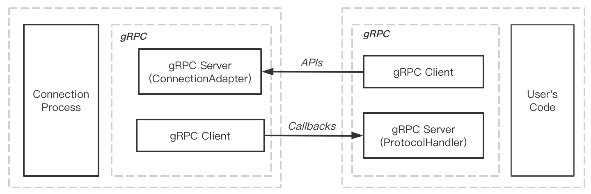

# emqx-exproto

The `emqx_exproto` extremly enhance the extensibility for EMQ X. It allow using an others programming language to **replace the protocol handling layer in EMQ X Broker**.

## Feature

- [ ] Support Pyhoth, Java.
- [x] Support the `tcp`, `ssl`, `udp`, `dtls` socket.
- [x] Provide the `PUB/SUB` interface to others language.

We temporarily no plans to support other languages. Plaease open a issue if you have to use other programming languages.

## Architecture

## Drivers

### Python

***Requirements:***

- It requires the emqx hosted machine has Python2/Python3 Runtimes
- An executable commands in your shell, i,g: `python2` or `python3`

***Examples:***

See `example/main.py`

### Java

***Work in progress...***

## SDK

***Work in progress...***

## Benchmark

***Work in progress...***

## Known Issues or TODOs

- Configurable Log System.
    * The Java driver can not redirect the `stderr` stream to erlang vm on Windows platform

## Reference

- [erlport](https://github.com/hdima/erlport)
- [Eexternal Term Format](http://erlang.org/doc/apps/erts/erl_ext_dist.html)
- [The Ports Tutorial of Erlang](http://erlang.org/doc/tutorial/c_port.html)

